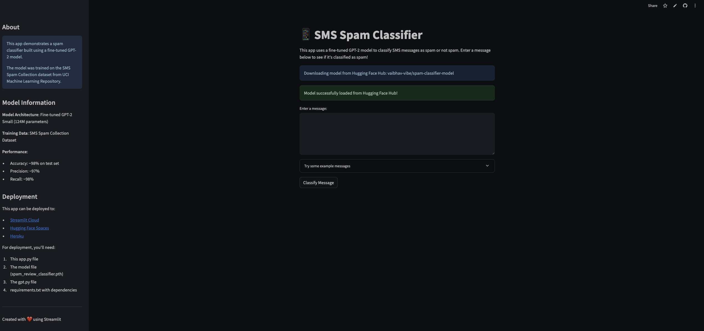

# 📱 SMS Spam Classifier


> A sleek, interactive web application that uses a fine-tuned GPT-2 model to detect spam messages with high accuracy.

## ✨ [Live Demo](https://llm-spam-classifier-model.streamlit.app/)



## 🚀 Overview

This application demonstrates the power of transformer-based language models for text classification tasks. Using a custom-trained GPT-2 model, it can identify spam messages with remarkable accuracy, providing a practical example of NLP in action.

### Key Features

- 🤖 Fine-tuned GPT-2 model for spam detection
- 📊 Real-time classification with confidence scores
- 🎨 Clean, intuitive user interface
- 🔄 Example messages to test functionality
- 📱 Mobile-friendly design

## 🧠 The Model

The classifier is built on a fine-tuned GPT-2 small model (124M parameters), trained on the SMS Spam Collection dataset. The model achieves:

- **Accuracy**: ~98% on test set
- **Precision**: ~97%
- **Recall**: ~98%

The model is hosted on Hugging Face Hub: [vaibhav-vibe/spam-classifier-model](https://huggingface.co/vaibhav-vibe/spam-classifier-model/tree/main)

## 🛠️ Technical Implementation

The complete implementation of the GPT-2 model from scratch can be found in this repository:
[https://github.com/vaifai/GPT2_from_scratch](https://github.com/vaifai/GPT2_from_scratch)

The repository includes:
- Custom implementation of the GPT architecture
- Training pipeline for text classification
- Fine-tuning process for spam detection
- Evaluation metrics and analysis

## 🚀 Getting Started

### Prerequisites

```bash
pip install -r requirements.txt
```

### Running Locally

```bash
streamlit run app.py
```

## 📚 How It Works

1. Enter a message in the text area
2. Click "Classify Message"
3. View the classification result with confidence score
4. Try example messages to see how the model performs on known spam and ham

## 🔮 Future Improvements

- Multi-language support
- Expanded training dataset
- Fine-tuning on domain-specific spam
- Explainable AI features to highlight spam indicators

## 👨‍💻 Author

**Vaibhav Pandey**

- [GitHub](https://github.com/vaifai)
- [Hugging Face](https://huggingface.co/vaibhav-vibe)

## 📝 License

This project is open source and available under the [MIT License](LICENSE).

---

*This project was created as part of a learning portfolio to demonstrate practical applications of transformer-based language models.*
